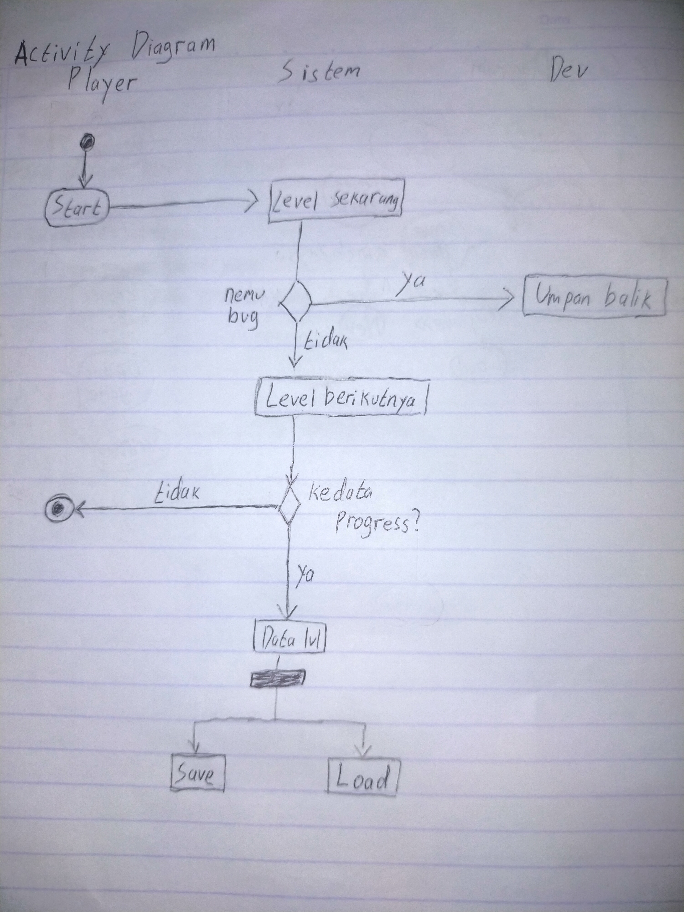
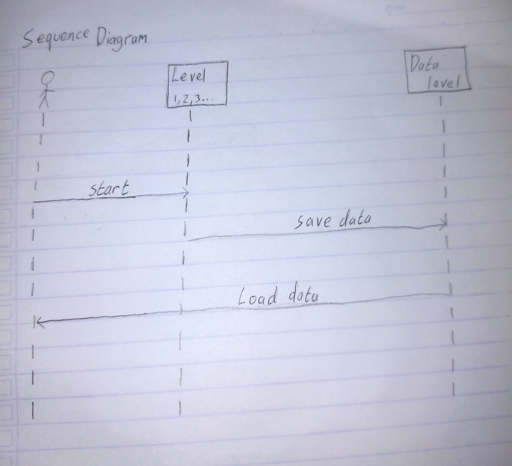

## 1. Project Sistem Informasi: NoWords Game

## 2. Analisa
### 2.1 Permasalahan
- Game dibuat untuk game jam
- ketidaksesuai layar saat mengexport ke android
### 2.2 Kebutuhan Sistemnya
- Mengembangkan game yang hanya dijalankan di browser
- NoWords yaitu game puzzle yang tiada kata-kata didalam game

## 3. Use Case Diagram

## 4. Activity Diagram

## 5. Sequence Diagram
